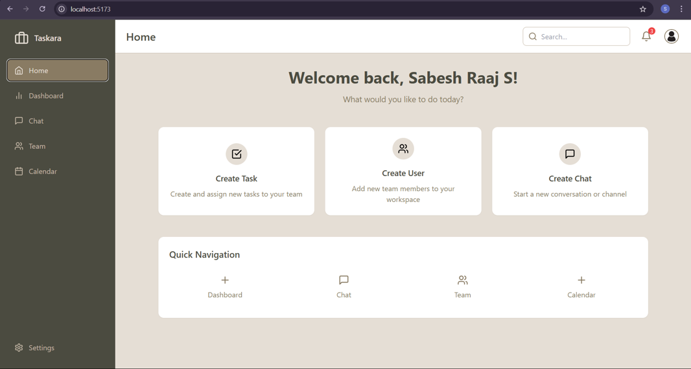
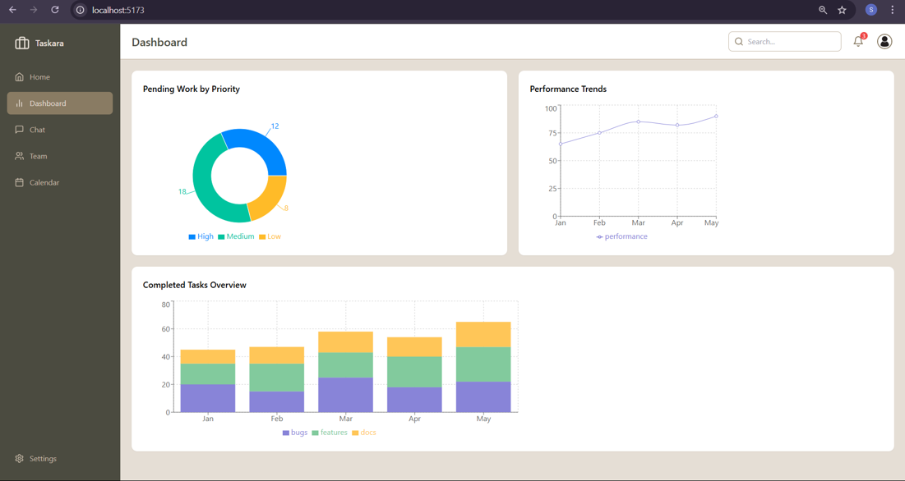
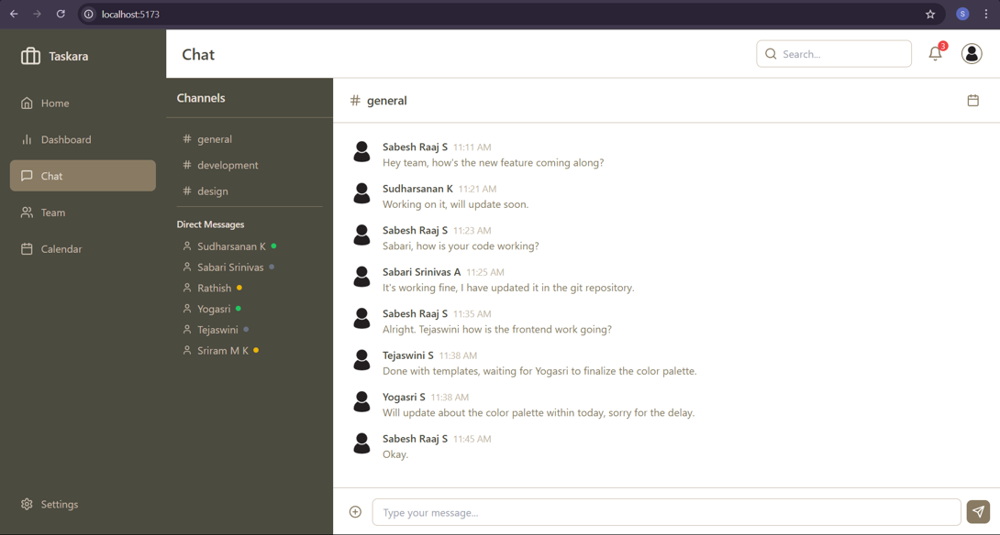
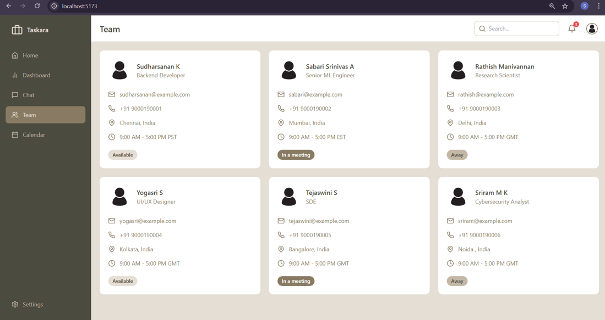
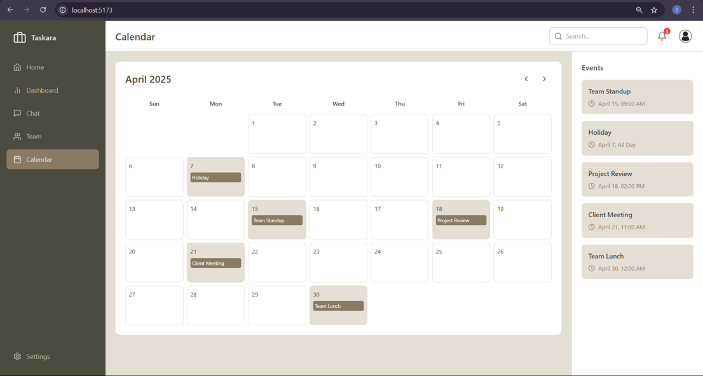
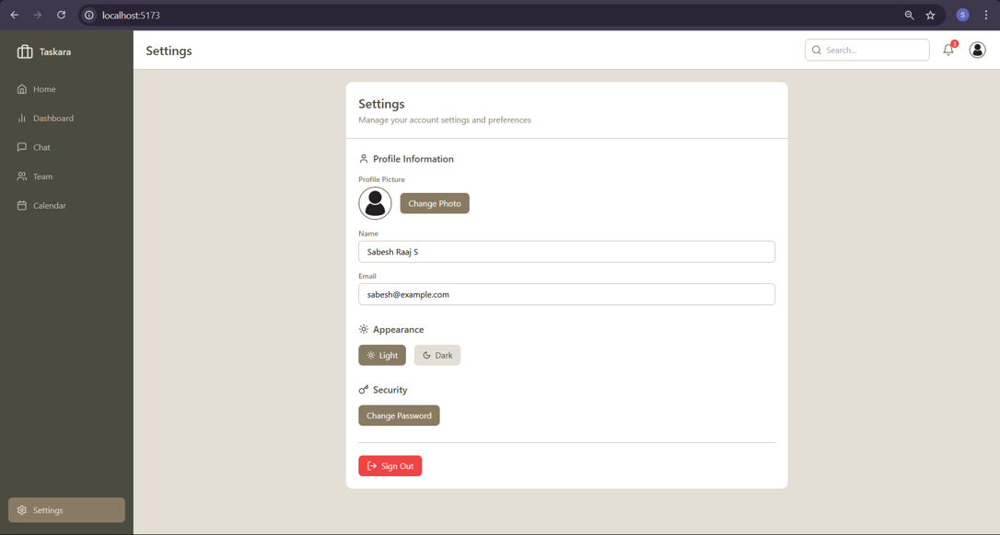
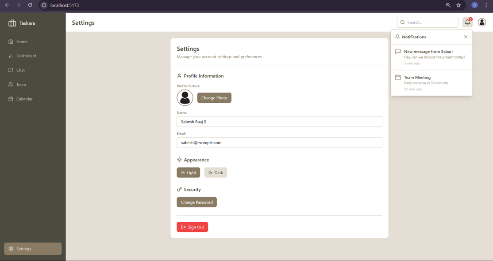

# Taskara - Process Planning Software 🚀

**Taskara** is an intuitive and efficient process planning software designed to streamline workflow management, enhance team collaboration, and provide insightful data visualization.

---

## 🌟 Features  

### 🔹 Interactive Chat System  
- Private and group messaging  
- Meeting scheduling & room allocation  
- Tagged notifications for important updates  
- Smart search for quick access to past conversations  
- Message prioritization (Urgent, Important)  

### 📊 Statistical Dashboards  
- **Pending Work Tracker** – Bar/Pie chart categorizing tasks by priority  
- **Performance Improvement Analysis** – Line chart tracking task completion trends  
- **Completed Work Overview** – Stacked bar chart for completed tasks over time  
- **Notifications Dashboard** – Donut/timeline chart categorizing notifications  
- **Workload Distribution Analysis** – Heatmap for workload optimization  
- **Project Success & Failure Analytics** – Comparative charts for project performance  

---

## 🛠️ Installation & Setup  

1. **Clone the Repository**  
   ```sh
   git clone https://github.com/sabeshraaj/Taskara.git
   cd Taskara
   ```

2. **Install Dependencies**  
   ```sh
   npm install
   ```

3. **Run the Development Server**  
   ```sh
   npm run dev
   ```

4. **Build for Production**  
   ```sh
   npm run build
   ```

---

## 🎯 Tech Stack  

- **Frontend:** React (TypeScript), TailwindCSS  
- **Backend:** Node.js, Express.js  
- **Database:** MongoDB  
- **State Management:** Redux  
- **Real-time Communication:** Socket.io  

---

## 🖥️ Screenshots  

### Output 1


### Output 2


### Output 3


### Output 4


### Output 5


### Output 6


### Output 7



---

## 📌 Roadmap  
✅ Interactive chat system  
✅ Statistical dashboards  
🔲 AI-powered task prioritization *(Upcoming)*  
🔲 Mobile app integration *(Upcoming)*  

---

## 🤝 Contributing  
Contributions are welcome! Follow these steps:  

1. **Fork the repository**  
2. **Create a new branch:** `git checkout -b feature-branch`  
3. **Commit your changes:** `git commit -m "Added new feature"`  
4. **Push to the branch:** `git push origin feature-branch`  
5. **Create a Pull Request**  


---   

---

### 🚀 Taskara – Plan Smart, Work Efficiently!  

